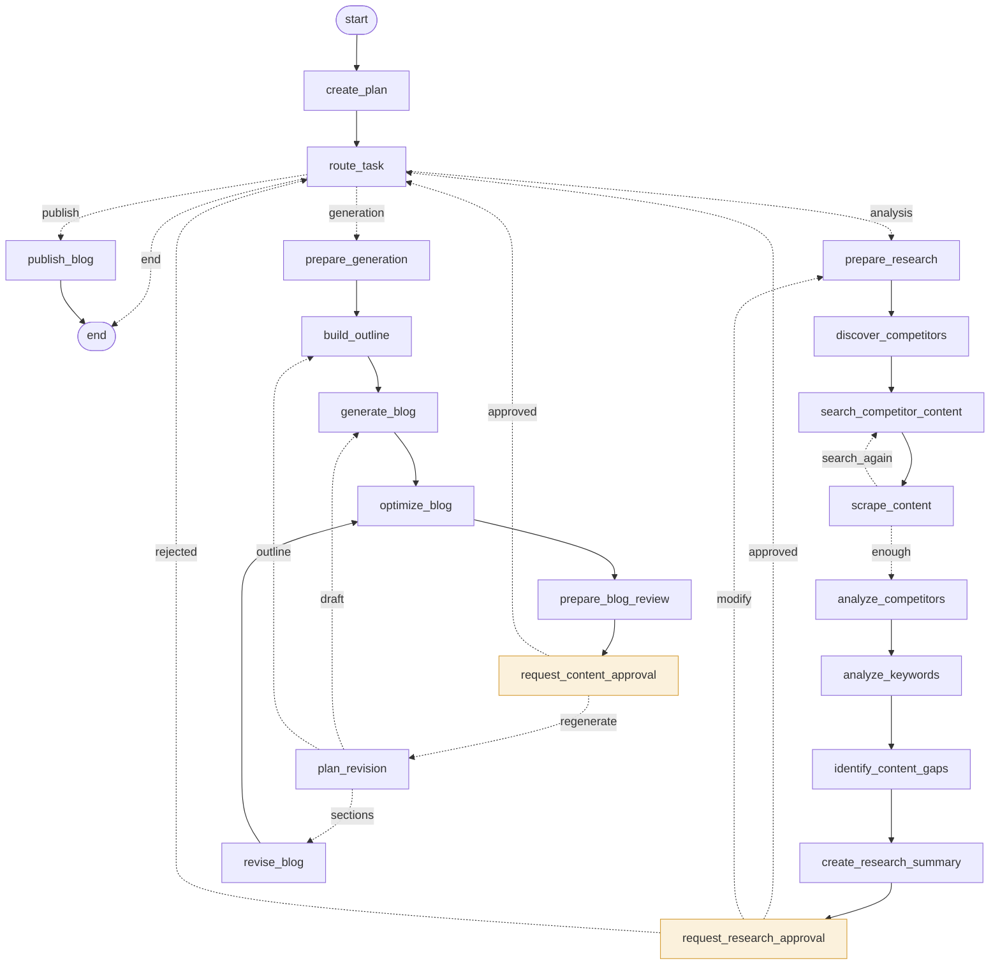

# ContentCrew

AI agents that research, analyze, generate and publish marketing content, with you in the loop.

> Research → Analyze → Approve → Generate → Review → Publish

Built for the AI Solutions Engineering course. `ContentCrew_Project_Context.md` is the product and
architecture spec and the source of truth for every decision in this repo.

## Status

| Phase | Scope | State |
|---|---|---|
| 1 | Frontend: design system, landing page, 3-column dashboard, timeline, blog editor | Done |
| 2 | App foundation: Flask, SQLite, APIs, live event stream, onboarding | Done |
| 3 | LangGraph workflow: Supervisor, Analysis and Generation agents, nodes, tools, human approvals | Done |
| 4 | Analysis Agent as a real agent: competitor discovery, targeted search, source selection, a "search again?" loop, richer analysis, typed research output, node/tool events | Done |
| 5 | Generation Agent: writes from the approved research, checks its own outline, measured SEO optimization, regeneration that redoes only what the feedback is about | Done |
| 6 | Workspace UI: compact approval cards, outline and SEO in the editor, regenerate with feedback, research summary | Done |
| 7 | Integration: publishing through `POST /blog`, Cancel request, draft/approval consistency, exact status text, traceable events | Done |

The whole flow, step by step, is in [docs/END_TO_END.md](docs/END_TO_END.md).

## Run it (Windows)

```powershell
cd D:\Projects\contentcrew
.venv\Scripts\activate
pip install -r requirements.txt
copy .env.example .env      # first time only; then add your keys
python app.py
```

Open http://127.0.0.1:5000. Run the tests with `python -m pytest`.
Print the workflow graph, generated from the code, with `python -m graph.workflow`.

**Everything is free.** Two optional keys, both free with no credit card:

| Key in `.env` | Where to get it | What it unlocks |
|---|---|---|
| `GROQ_API_KEY` | [console.groq.com/keys](https://console.groq.com/keys) | The language model (`openai/gpt-oss-120b` on Groq's free tier; set `LLM_MODEL` to it): writing, research planning, content-gap analysis |
| `SEARCH_API_KEY` | [app.tavily.com](https://app.tavily.com) | Web search (1,000 free searches a month; a run uses about 5 to 10) |

| You have | What works |
|---|---|
| No keys | Planning, research by reading competitor websites from your context, keyword and competitor analysis (heuristic), research approval. Writing stops with a message saying a model is needed. |
| Groq key | Everything: the full workflow through both approvals to a published post. |
| Groq + Tavily keys | The Analysis Agent also finds articles through web search, not only competitor homepages. |

After adding a key, restart the app. If a run stopped because a key was missing, select **Retry**:
it continues from the step that failed, without redoing the research.

Keyword search volume and difficulty only come from paid data sources, so keyword rankings stay
heuristic (counted from competitor content) and are labelled that way.

## Architecture

```
Browser (frontend/)
   │  POST /api/chat, /api/approval/*        ▲ live events (Server-Sent Events)
   ▼                                         │
Flask API (api/)  ──►  WorkflowRunner (services/workflow_runner.py)  ──►  events table
                              │  invoke / resume / retry                  ▲
                              ▼                                           │
                      LangGraph graph (graph/workflow.py)                 │
                      ┌──────────────────────────────────────┐            │
                      │ Supervisor nodes ─► Analysis nodes    │── emit ────┘
                      │        ▲               │              │
                      │        │        [research approval]   │
                      │        │               ▼              │
                      │        └──── Generation nodes         │
                      │                        │              │
                      │                [content approval]     │
                      │                        ▼              │
                      │                   Publish node        │
                      └──────────────────────────────────────┘
                         │ calls                 │ saves state after every step
                         ▼                       ▼
                 agents/ + tools/        data/checkpoints.db (LangGraph checkpointer)
```

### The pieces and how they differ

| Piece | Folder | What it is | Example |
|---|---|---|---|
| **Agent** | `agents/`, `supervisor/` | A specialist: its own prompt, judgement and (optionally) a language model. Knows nothing about the graph. | `AnalysisAgent.build_strategy()` finds content gaps |
| **Node** | `nodes/` | One step of the workflow. Reads the state, calls an agent and/or tools, reports progress, returns the fields it changed. | `identify_content_gaps` |
| **Tool** | `tools/` | One external capability, no judgement. Always returns `ok`, `empty`, `not_configured` or `error`. | `web_scraper.fetch_page()` |
| **Graph** | `graph/` | The shared state, and which node runs after which (including conditional routes). | `build_workflow()` |
| **Supervisor** | `supervisor/` | Orchestration only: understands the request, keeps the plan, decides who works next. | `Supervisor.decide_next()` |
| **Flask** | `api/` | HTTP boundary. Validates input and calls the runner; never touches the graph directly. | `POST /api/chat` |
| **Frontend** | `frontend/` | Shows the live activity and collects your decisions. | the approval card |

- **Agents vs nodes:** an agent decides *how* to do a kind of work; a node decides *when* it happens
  and records it. Several nodes use the same agent (four analysis nodes, one Analysis Agent).
- **Tools vs nodes:** a tool does one concrete thing and returns a result. A node decides which
  tools to call, what to do when one fails, and what goes into the state.

### The workflow graph

Generated from the code with `python -m graph.workflow`:



Dotted arrows are **conditional edges**: a function reads the state and picks the next node.
Every hand-off between agents goes back through `route_task`, so the Supervisor is always the one
assigning work.

### The Analysis Agent (Phase 4)

The agent owns four tools and makes the research decisions. With a language model it decides;
without one it falls back to a transparent rule and the timeline says which happened.

| Node | What the agent decides or does | Tools |
|---|---|---|
| `prepare_research` | Plans 3-4 search queries (uses your feedback after "Modify") | |
| `discover_competitors` | Uses the competitors in your context; if there are none, finds them in search results (a model's picks must appear in the results) | Google Search |
| `search_competitor_content` | Runs the queries plus one search limited to the competitors' own sites | Google Search |
| `scrape_content` | Chooses which results to read (at most 2 pages per site), reads them, then judges coverage: fewer than 3 different sites means **search again**, at most once | Web Scraper |
| `analyze_competitors` | Shared topics, common headings, questions answered, article length, structure per source, topics only one source covers | Competitor Analysis |
| `analyze_keywords` | Real counts per keyword plus heuristic difficulty, intent and related phrases, all labelled "(heuristic)" | Keyword Analysis |
| `identify_content_gaps` | Content gaps, search intent, target keywords, recommended structure, a short summary (needs the model) | |
| `create_research_summary` | Builds the typed `ResearchOutput` and the approval card | |

Then the graph pauses: *"Research completed. Review the strategy before content generation."*
The approval is part of the graph state and enforced by the backend.

**Keyword metrics:** search volume and difficulty need a paid data source, and this project is
free, so `keyword_metrics.status` is `not_configured`. Nothing numeric is ever estimated.

### The Generation Agent (Phase 5)

It writes only from `research_output`, exactly what you approved, plus your company context and
request. It never sees competitor page text, only the analysis of it, so it has nothing to copy.
Code keeps it inside the strategy: the target keyword must be an approved keyword, section keywords
are filtered to the approved list, and "gaps covered" must match approved gaps.

| Node | What the agent decides or does | Tools |
|---|---|---|
| `prepare_generation` | Checks the approved research is there (refuses if not), picks the main and other keywords, sets a target length from competitor article lengths | |
| `build_outline` | Outline: title, target keyword, sections with purpose and keywords, gaps covered. Then **checks its own outline** (copied competitor headings? keyword missing from the title? ignored the approved structure or gaps?) and fixes it once. May do **one** lookup if the outline needs a missing fact | Google Search (optional, snippets only) |
| `generate_blog` | The full Markdown draft from the outline | |
| `optimize_blog` | Measures the draft, sends **only the measured problems** to the model, measures again, and keeps the new version only if it's better | SEO Analysis |
| `prepare_blog_review` | Saves the draft, opens the editor, pauses for your decision | |
| `plan_revision` | After you ask for changes: decides how far back to go | |
| `revise_blog` | Rewrites only the sections your feedback is about | |

**SEO Analysis** (`tools/seo_analysis.py`) counts, never estimates: main keyword in the title,
introduction and headings; how often each approved keyword is used (and stuffing); sentence and
paragraph length and a Flesch reading-ease score (labelled approximate); topics competitors share;
8-word phrases matching a competitor page; and figures (percentages, amounts, years) that appear
nowhere in your context or the research, which the review card lists for you to check.

**Review and regeneration.** The draft opens in the editor and the graph pauses
(*"Content approval required"*). Nothing is published until you choose **Publish**. To change it,
press **Regenerate** or type what you want in the chat. The agent picks the smallest step:

| You say | The agent goes back to | What's kept |
|---|---|---|
| "Make the introduction more concise" | `revise_blog`: only that section | every other section exactly, including your own edits |
| "Make it more casual" / Regenerate with no text | `generate_blog`: new draft | the approved outline |
| "Add a section about pricing" | `build_outline`, then a new draft | the approved research |

The research is never rerun. `revision_count` and `revision_history` record every round.

**Download.** To put a post on your own website, use **Download** at the top of the editor:
a web page (`.html`, which you can also open in Word) or Markdown (`.md`). The file holds exactly
what the editor shows, including edits you haven't saved, and works for drafts and published posts.
Publishing itself goes to the app's own blog (`POST /blog`, viewable at `/blog/<slug>`).

**Dark mode.** The sun/moon button in every page's header switches between light and dark.
The choice is remembered in your browser; until you pick one, the app follows your system setting.

### Live events

The timeline is built only from these events (`services/events.py`):
`agent_started`, `agent_completed`, `node_started`, `node_completed`, `tool_started`,
`tool_completed`, `plan_updated`, `approval_required`, `approval_resolved`, `blog_ready`,
`blog_published`, `error`, plus `message` and `workflow`. Every tool event names the node it ran in,
so the UI shows each LangGraph node with its tool calls underneath. No model reasoning is stored or
shown.

### How LangGraph fits

LangGraph is the orchestration and state layer:

1. **State.** `graph/state.py` defines `ContentCrewState`, a typed dictionary every node shares.
   A node returns only the fields it changed, and LangGraph merges them in. List fields like
   `tool_events` and `errors` use `operator.add`, so updates append instead of replacing.
2. **Nodes and edges.** `graph/workflow.py` registers each node and connects them. `route_task`
   and both approval nodes have conditional edges.
3. **Checkpointing.** After every step LangGraph saves the state to `data/checkpoints.db`
   (`SqliteSaver`). That's what makes pausing, retrying and surviving a restart possible.
4. **Human in the loop.** The approval nodes call `interrupt(...)`. The graph stops there and
   `invoke()` returns. The app shows the approval card. When you decide, the runner calls
   `invoke(Command(resume={"decision": "approve"}))` and the graph continues inside the same node.
5. **Runtime context.** Things that must not be saved in checkpoints (settings, database, event
   emitter, the language model) are passed as `context` (`graph/context.py`). Nodes read them from
   `runtime.context`.

### How state moves through the graph

```
user_request, company_context, competitor_context      (set by the runner)
  create_plan            -> request_type, topic, plan
  route_task             -> next_step = "analysis"
  prepare_research       -> research_queries
  discover_competitors   -> competitors
  search_competitor_content -> search_results, used_search
  scrape_content         -> scraped_content, source_urls
  analyze_competitors    -> competitor_analysis
  analyze_keywords       -> keywords, keyword_metrics
  identify_content_gaps  -> content_gaps, search_intent, seo_strategy
  create_research_summary-> research_summary
  request_research_approval  (pause)  -> research_approved, research_feedback
  route_task             -> next_step = "generation"
  prepare_generation     -> generation_status, target_keyword, secondary_keywords
  build_outline          -> blog_outline, blog_title, extra_research
  generate_blog          -> blog_draft
  optimize_blog          -> blog_draft (only if improved), seo_report
  prepare_blog_review    -> blog_id, content_approval_required = true
  request_content_approval   (pause)  -> content_approved, content_feedback
     regenerate: plan_revision -> revision_count, revision_plan, revision_history
                 then revise_blog / generate_blog / build_outline, as above
  route_task             -> next_step = "publish"
  publish_blog           -> publish_status, published_slug
```

The Generation Agent only sees research after you approve it, and the edits you make in the editor
are what gets published.

### What you see vs. what's hidden

The timeline shows observable actions only: which agent and node are active, each tool call and
its result, the plan, approvals and errors. Model reasoning is never stored or shown.

## Safety

Web content is untrusted data and can never change instructions, approvals or publishing
permissions. The layers (escaping, prompt rules, validated structured answers, code-enforced
approvals, a network-safe scraper) are explained in [docs/SECURITY.md](docs/SECURITY.md).

## Folder structure

```
contentcrew/
├── app.py                      Flask entry point: wires everything together
├── config.py                   settings from .env
├── supervisor/supervisor_agent.py   request understanding, plan, routing rules
├── agents/
│   ├── analysis_agent.py       the research agent: its tools and decisions
│   ├── policy.py               untrusted-content rules shared by both agents
│   └── generation_agent.py     the writing agent: brief, outline + self-check, draft, optimize, revisions
├── nodes/
│   ├── supervisor_nodes.py     create_plan, route_task
│   ├── analysis_nodes.py       prepare_research ... create_research_summary (+ the search-again loop)
│   ├── approval_nodes.py       request_research_approval, request_content_approval (+ the review card)
│   ├── generation_nodes.py     prepare_generation ... prepare_blog_review, plan_revision, revise_blog
│   └── publish_nodes.py        publish_blog
├── tools/
│   ├── google_search.py        web search via Tavily (free) or Serper, or "not configured"
│   ├── web_scraper.py          safe page reader (robots.txt, private-address block, limits)
│   ├── keyword_analysis.py     heuristic keyword ranking; real metrics only from a provider
│   ├── competitor_analysis.py  shared themes and headings across competitor pages
│   ├── seo_analysis.py         measures a draft: keyword placement, readability, copied phrases, figures
│   └── publish_blog.py         sends POST /blog over HTTP; the blog API checks approval, state and draft
├── graph/
│   ├── state.py                ContentCrewState + workflow statuses
│   ├── context.py              runtime context, StepFailed
│   └── workflow.py             the graph
├── services/
│   ├── workflow_runner.py      Flask ↔ LangGraph boundary: start, pause, resume, retry
│   ├── events.py               UI event model + the emitter nodes use
│   └── publishing.py           the publishing rules (shared by the API and the tool)
├── api/                        HTTP endpoints under /api
├── storage/                    SQLite schema, migrations, repositories
├── llm/provider.py             language-model factory (Groq free tier by default) and plain-language errors
├── frontend/                   landing, onboarding, workspace, public post page
├── data/                       sample company; databases are created here
├── docs/SECURITY.md            how untrusted web content is contained
├── docs/END_TO_END.md          the whole flow, from request to "Blog published successfully"
└── tests/                      134 tests: tools, both agents, API, the full workflow, integration
```

## API

| Method | Path | Purpose |
|---|---|---|
| GET / PUT | `/api/context` | Marketing context (onboarding) |
| POST | `/api/chat` | `{message, session_id?}` start a workflow run, or (while a draft waits for review) ask for changes |
| GET | `/api/status?session_id=` | Agent, node, approval, generation (status, revisions, keywords), blog and publish status |
| GET | `/api/sessions/<id>` | Session + all events |
| GET | `/api/sessions/<id>/events` | Live events (Server-Sent Events) |
| GET | `/api/sessions/<id>/trace` | Every step as flat rows: time, workflow, agent, node, tool, status, result |
| POST | `/api/sessions/<id>/retry` | Run the failed step again |
| POST | `/api/approval/research` | `{session_id, decision: approve, modify or reject (Cancel request), feedback}` |
| POST | `/api/approval/content` | `{session_id, decision: approve (Publish) or regenerate, feedback?}` |
| GET / PATCH | `/api/blog/<id>` | Read a draft, or edit the current one while it's in review |
| POST | `/blog` | Publish. Called by the Publish Blog tool over HTTP; refused unless approved, at the publish step, current draft, not empty (alias `/api/blog`) |
| GET | `/api/posts/<slug>` | A published post (shown at `/blog/<slug>`) |
| GET | `/api/health` | Health and which integrations are configured |

## What's next

- Add a password before putting the app online (there are no user accounts yet). Free hosting
  options for a small Flask app exist, but only once that's in place.
- Optional: stream the draft as it's written.

## License

Copyright (c) 2026 Massab Ibrahim. All rights reserved.

This code is public to read, not to use. You may not deploy, host, copy, modify or redistribute
it, or submit it as your own work, without written permission. See [LICENSE](LICENSE).
